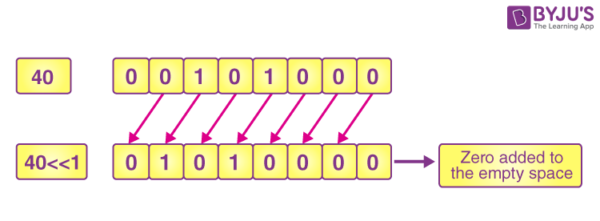
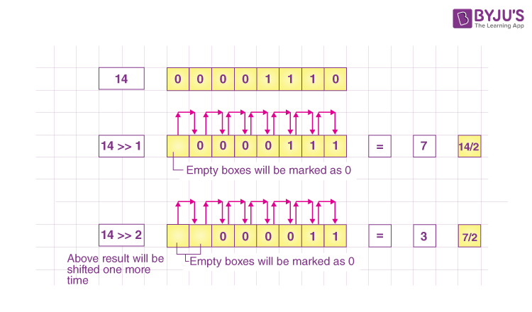

# Bitwise Operations

### Bitwise XOR (^)

| variable_1 | variable_2 | result | status    |
| ---------- | ---------- | ------ | --------- |
| true       | true       | false  | same      |
| true       | false      | true   | different |
| false      | true       | true   | different |
| false      | false      | false  | same      |

### Bitwise Left Shift (<<)

### Bitwise Right Shift (>>)

### Bitwise Unsigned Left Shift (<<<)

This operator is a binary operator, denoted by ‘<<<’. It returns the value of the first operand, left shifted by the number of bits specified by the second operand, with zeros placed in the least significant bits.

| variable_1 | variable_2 | result |
| ---------- | ---------- | ------ |
| 1          | 1          | 2      |
| 1          | 2          | 4      |
| 1          | 3          | 8      |
| 1          | 4          | 16     |

### Bitwise Unsigned Right Shift (>>>)

This operator is a binary operator, denoted by ‘>>>’. It returns the value of the first operand, right shifted by the number of bits specified by the second operand, with zeros placed in the most significant bits.

| variable_1 | variable_2 | result |
| ---------- | ---------- | ------ |
| 16         | 1          | 8      |
| 16         | 2          | 4      |
| 16         | 3          | 2      |

