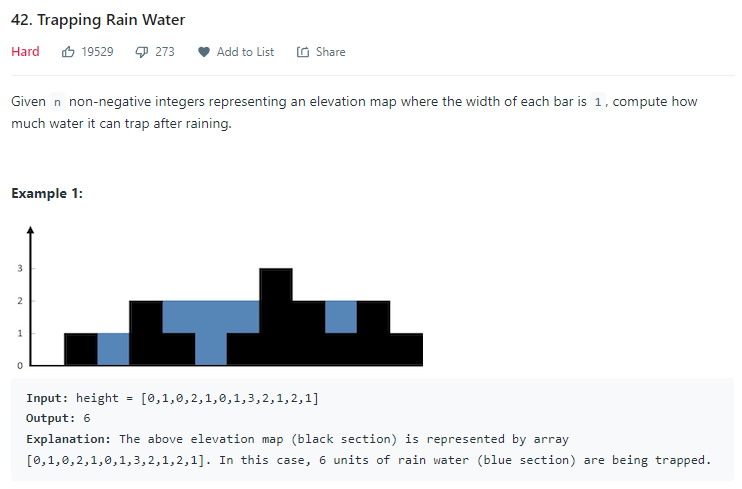
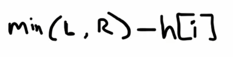

import Tabs from '@theme/Tabs';
import TabItem from '@theme/TabItem';

# Common Problems


## Priniting the combination of an array of particular size.

```java showLineNumbers
class Solution {
    public static void findCombinations(int[] A, int i, int k, List<Integer> out)
    {
        if (k == 0) {
            //Operation with List<Integer> out
            return;
        }
    
        // start from the next index till the last index
        for (int j = i; j < A.length; j++)
        {
            out.add(A[j]);
            findCombinations(A, j + 1, k - 1, out);
            out.remove(out.size() - 1);        // backtrack
        }
    }
}
```

```java showLineNumbers
class Solution {
    public List<List<Integer>> subsets(int[] nums) {
        List<List<Integer>> output = new ArrayList();
        output.add(new ArrayList<Integer>());

        for (int num : nums) {
            List<List<Integer>> newSubsets = new ArrayList();
            for (List<Integer> curr : output) {
            newSubsets.add(new ArrayList<Integer>(curr){{add(num);}});
            }
            for (List<Integer> curr : newSubsets) {
            output.add(curr);
            }
        }
        return output;
    }
}
```

```java showLineNumbers
class Solution {
        public static void main(String[] args){
                int[] A = { 1, 2, 3 };
        int k = 2;
        System.out.println(findCombinations(A, 0, k, new ArrayList<>()));

                // If you want to print out all the combination then you can put a for loop 
                // on the length of the A starting from 1.
        }
}

// This is a call to the left method for printing out the combination of length 2 from the array.
```

## Printing all the possible paths of a binary tree.

```java showLineNumbers
class Solution {
    public void printAllPathsBinaryTree(TreeNode root) {
            ArrayList<Integer> path = new ArrayList<Integer>();
            printPathsBinaryTree(root, path);
        }
        
        public void printPathsBinaryTree(TreeNode root, ArrayList<Integer> path) {
            if (root == null) {
                return;
            }
            path.add(root.data);
            if (root.left == null && root.right == null) {
                System.out.println(path);
            }
            printPathsBinaryTree(root.left, path);
            printPathsBinaryTree(root.right, path);
            path.remove(path.size() - 1);
        }
}
```

> **APPLICATIONS**
>
> -   **Can be used to calculate the longest path from any node to targeted node.**
> -   **Can be used to find the path with all the equal values in them.**

## Permutation of an array.

```java showLineNumbers
class Solution {
    void permutate(int[] array, int start) {
            if (start == array.length) {
                //computations.
                return;
            }
            for (int i = start; i < array.length; ++i) {
                this.swap(array, i, start);
                this.permutate(array, start + 1);
                this.swap(array, i, start);
            }
        }
        void swap(int[] array, int i, int j) {
            if (i != j) {
                int temp = array[i];
                array[i] = array[j];
                array[j] = temp;
            }
        }
}
```

## Roman to Integer.

```java showLineNumbers
class Solution {
    public int romanToInt(String S) {
        int ans = 0, num = 0;
        for (int i = S.length()-1; i >= 0; i--) {
            switch(S.charAt(i)) {
                case 'I': num = 1; break;
                case 'V': num = 5; break;
                case 'X': num = 10; break;
                case 'L': num = 50; break;
                case 'C': num = 100; break;
                case 'D': num = 500; break;
                case 'M': num = 1000; break;
            }
            if (4 * num < ans) ans -= num;
            else ans += num;
        }
        return ans;
    }
}
```

```python
class Solution:
    def romanToInt(self, s: str) -> int:
        translations = {
            "I": 1,
            "V": 5,
            "X": 10,
            "L": 50,
            "C": 100,
            "D": 500,
            "M": 1000
        }
        number = 0
        s = s.replace("IV", "IIII").replace("IX", "VIIII")
        s = s.replace("XL", "XXXX").replace("XC", "LXXXX")
        s = s.replace("CD", "CCCC").replace("CM", "DCCCC")
        for char in s:
            number += translations[char]
        return number
```

## Rotate a Matrix.

```java showLineNumbers
class Solution {

    public void rotate(int[][] matrix) {
    transpose(matrix);
    reflect(matrix);
    }

    public void transpose(int[][] matrix) {
    int n = matrix.length;
    for (int i = 0; i < n; i++) {
        for (int j = i + 1; j < n; j++) {
        int tmp = matrix[j][i];
        matrix[j][i] = matrix[i][j];
        matrix[i][j] = tmp;
        }
    }
    }

    public void reflect(int[][] matrix) {
    int n = matrix.length;
    for (int i = 0; i < n; i++) {
        for (int j = 0; j < n / 2; j++) {
        int tmp = matrix[i][j];
        matrix[i][j] = matrix[i][n - j - 1];
        matrix[i][n - j - 1] = tmp;
        }
    }
    }
}
```

## Spiral Matrix.

```java showLineNumbers
class Solution {
    public List<Integer> spiralOrder(int[][] matrix) {
        List<Integer> nums = new ArrayList();
        if(matrix == null||matrix.length == 0){
            return nums;
        }
        int size = matrix[0].length * matrix.length;
        
        int top = 0;
        int bottom = matrix.length-1;
        int left = 0;
        int right = matrix[0].length-1;
        
        while(nums.size()<size){
            for(int i=left; i<=right && nums.size()<size;i++){
                nums.add(matrix[top][i]);
            }
            top++;
            for(int i=top; i<=bottom && nums.size()<size;i++){
                nums.add(matrix[i][right]);
            }
            right--;
            for(int i=right;i>=left && nums.size()<size;i--){
                nums.add(matrix[bottom][i]);
            }
            bottom--;
            for(int i=bottom;i>=top && nums.size()<size;i--){
                nums.add(matrix[i][left]);
            }
            left++;
        }
        return nums;
        
    }
}
```

## House Robber.

```java showLineNumbers
class Solution {
    public int rob(int[] nums) {
        if(nums.length == 1) return nums[0];
        int[] dp = new int[nums.length];
        dp[0] = nums[0];
        dp[1] = nums[1];
        dp[1] = Math.max(nums[0],nums[1]);
        for(int i = 2;i<nums.length;i++){
            dp[i] = Math.max(dp[i-1],dp[i-2]+nums[i]);
        }
        return dp[dp.length-1];
    }
}
```

## Number of Islands.

```java showLineNumbers
class Solution {
    public int numIslands(char[][] grid) {
        int result = 0;
        if(grid == null || grid.length == 0) return 0;
        
        for(int i=0;i<grid.length;i++){
            for(int j=0;j<grid[i].length;j++){
                if(grid[i][j] == '1'){
                    result += dfs(grid, i, j);
                }
            }
        }
        
        return result;
    }
    public int dfs(char[][] grid, int i, int j){
        if(i<0 || i>=grid.length || j<0 || j>=grid[i].length || grid[i][j] == '0'){
            return 0;
        }
        grid[i][j] = '0';
        dfs(grid,i+1,j);
        dfs(grid,i-1,j);
        dfs(grid,i,j+1);
        dfs(grid,i,j-1);
        return 1;
    }
}
```

## Count Primes

```java showLineNumbers
public class Solution {
    public int countPrimes(int n) {
        boolean[] notPrime = new boolean[n];
        int count = 0;
        for (int i = 2; i < n; i++) {
            if (notPrime[i] == false) {
                count++;
                for (int j = 2; i*j < n; j++) {
                    notPrime[i*j] = true;
                }
            }
        }
        
        return count;
    }
}
```

## Maximal Square.

> **dp(i,j)=  (min(dp(i−1,j),dp(i−1,j−1),dp(i,j−1)))   +1.**

```java showLineNumbers
public class Solution {
    public int maximalSquare(char[][] matrix) {
        int rows = matrix.length, cols = rows > 0 ? matrix[0].length : 0;
        int[][] dp = new int[rows + 1][cols + 1];
        int maxsqlen = 0;
        for (int i = 1; i <= rows; i++) {
            for (int j = 1; j <= cols; j++) {
                if (matrix[i-1][j-1] == '1'){
                    dp[i][j] = (Math.min(Math.min(dp[i][j - 1], dp[i - 1][j]),dp[i - 1][j - 1])) + 1;
                    maxsqlen = Math.max(maxsqlen, dp[i][j]);
                }
            }
        }
        return maxsqlen * maxsqlen;
    }
}
```


## Trapping Rain Water

### Problem Statement


<div class="section-container pl0 pr0">
<div class="section-item pl0">



</div>
<div class="section-item">

```java
Calculate maxLeft and maxRight for each row.
Then, for each row, find the Math.min of the two for every index and subtract it from the current index height.

Math.min(maxLeft[i], maxRight[i]) - height[i] is the maximum water that can be trapped in the ith row.

```
</div>
</div>

### Solution

<Tabs>
  <TabItem value="method-1" label="Method 1 - Extra Space" default>

``` java
public int trap(int[] height) {
    int n = height.length;
    if (n <= 2) return 0;
    // pre-compute
    int[] leftMax = new int[n];
    int[] rightMax = new int[n];
    leftMax[0] = height[0]; // init
    rightMax[n - 1] = height[n - 1];
    for (int i = 1, j = n - 2; i < n; ++i, --j) {
        leftMax[i] = Math.max(leftMax[i - 1], height[i]);
        rightMax[j] = Math.max(rightMax[j + 1], height[j]);
    }
    // water
    int totalWater = 0;
    for (int k = 1; k < n - 1; ++k) { // do not consider the first and the last places
        int water = Math.min(leftMax[k - 1], rightMax[k + 1]) - height[k];
        totalWater += (water > 0) ? water : 0;
    }
    return totalWater;
}
// TC : O(n)
// SC : O(n)
```
  </TabItem>
  <TabItem value="method-2" label="Method 2 - No Space">

``` java
public int trap(int[] height) {
    if (height.length==0) return 0; 
    int left = 0, right = height.length-1; 
    int leftMax=0, rightMax=0; 
    int ans = 0; 
    while (left < right) {
        if (height[left] > leftMax) leftMax = height[left]; 
        if (height[right] > rightMax) rightMax = height[right];
        if (leftMax < rightMax) {
            ans += Math.max(0, leftMax-height[left]); 
            left++; 
        } else {
            ans += Math.max(0, rightMax-height[right]); 
            right--; 
        }
    }
    return ans; 
}
// TC : O(n)
// SC : O(1)
```
  </TabItem>
</Tabs>

## References

- <https://www.youtube.com/watch?v=ZI2z5pq0TqA&t=1229s>
- <https://leetcode.com/problems/trapping-rain-water/>