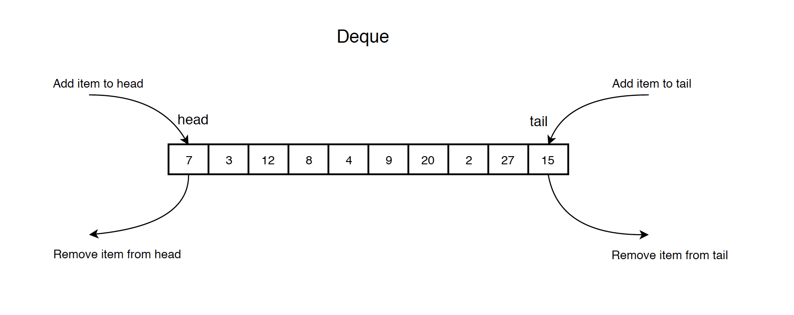

# Deque (Doubly Ended Queue)

## Introduction

A double-ended queue (abbreviated to deque) is an abstract data type that generalizes a queue, for which elements can be added to or removed from either the front (head) or back (tail).



## Operations & Complexities

`Deque<Integer> deque = new ArrayDeque<>();`

| Operation   | Complexity | Snippet                   |
| ----------- | ---------- | ------------------------- |
| addFirst    | `O(1)`     | `deque.addFirst(element)` |
| addLast     | `O(1)`     | `deque.addLast(element)`  |
| removeFirst | `O(1)`     | `deque.removeFirst()`     |
| removeLast  | `O(1)`     | `deque.removeLast()`      |
| peekFirst   | `O(1)`     | `deque.peekFirst()`       |
| peekLast    | `O(1)`     | `deque.peekLast()`        |
| isEmpty     | `O(1)`     | `deque.isEmpty()`         |

## Implementation of Deque

### Using Circular Array

```java showLineNumbers
public class CircularArrayDeque {
    private int head; // the first node in deque, not the first item in array
    private int tail; // the last node in deque, not the first item in array
    private int[] arr;
    private int size;
 
    public CircularArrayDeque(int capacity) {
        arr = new int[capacity];
        head = 0;
        tail = 0;
        size = 0;
    }
 
    // Add item to the head of the deque
    public void addFirst(int value) {
        // check if deque is full
        if (isFull()) {
            return;
        }
 
        head = head - 1;
        if (head < 0) {
            head = arr.length - 1;
        }
        arr[head] = value;
        size += 1;
    }
 
    // Remove the first item from the deque and return its value
    public int removeFirst() throws Exception {
        if (isEmpty()) {
            throw new Exception("Circular Array Deque is empty when dequeue!");
        }
        int value = arr[head];
        head = (head + 1) % arr.length;
        size -= 1;
        return value;
    }
 
    // Get the first item
    public int peekFirst() throws Exception {
        if (isEmpty()) {
            throw new Exception("Circular Array Deque is empty when peek!");
        }
        return arr[head];
    }
 
    // Add item to the end of the deque
    public void addLast(int value) {
        // check if deque is full
        if (isFull()) {
            return;
        }
        tail = (head + size) % arr.length;
        arr[tail] = value;
        size += 1;
    }
 
    // Remove the last item from the deque and return its value
    public int removeLast() throws Exception {
        if (isEmpty()) {
            throw new Exception("Circular Array Deque is empty when dequeue!");
        }
 
        int value = arr[tail];
        tail = tail - 1;
        if (tail < 0) {
            tail = arr.length - 1;
        }
        size -= 1;
        return value;
    }
 
    // Get the last item
    public int peekLast() throws Exception {
        if (isEmpty()) {
            throw new Exception("Circular Array Deque is empty when peek!");
        }
        return arr[tail];
    }
 
    // Return whether the queue is full
    public boolean isFull() {
        return size == arr.length;
    }
 
    // Return whether the queue is empty
    public boolean isEmpty() {
        return size == 0;
    }
}
```

### Using Linked List

```java showLineNumbers

public class ListNode {
    public int val;
    public ListNode prev;
    public ListNode next;
    public ListNode(int val) {
        this.val = val;
        this.prev = null;
        this.next = null;
    }
}

public class LinkedListDeque {
    private ListNode head; // the first node
    private ListNode tail; // the last node
 
    public LinkedListDeque() {
        head = null;
        tail = null;
    }
 
    // Add item to the head of the list
    public void addFirst(int value) {
        if (head == null) {
            head = new ListNode(value);
            tail = head;
        } else {
            head.prev = new ListNode(value);
            head.prev.next = head;
            head = head.prev;
        }
    }
 
    // Remove the head from the list and return its value
    public int removeFirst() throws Exception {
        if (head == null) {
            throw new Exception();
        }
        int value = head.val;
        head = head.next;
        if (head != null) {
            head.prev = null;
        } else {
            tail = null;
        }
        return value;
    }
 
    // Get the value of the head
    public int peekFirst() throws Exception {
        if (head == null) {
            throw new Exception();
        }
        return head.val;
    }
 
    // Add item to the tail of the list
    public void addLast(int value) {
        if (tail == null) {
            tail = new ListNode(value);
            head = tail;
        } else {
            tail.next = new ListNode(value);
            tail.next.prev = tail;
            tail = tail.next;
        }
    }
 
    // Remove the tail from the list and return its value
    public int removeLast() throws Exception {
        if (tail == null) {
            throw new Exception();
        }
        int value = tail.val;
        tail = tail.prev;
        if (tail != null) {
            tail.next = null;
        } else {
            head = null;
        }
        return value;
    }
 
    // Get the value of the tail
    public int peekLast() throws Exception {
        if (tail == null) {
            throw new Exception();
        }
        return tail.val;
    }
 
    // Return whether the deque is empty
    public boolean isEmpty() {
        return head == null || tail == null;
    }
}
```

## ArrayDeque Demo

```java showLineNumbers
public class ArrayDequeDemo {
  public static void main(String[] args) {
    Deque<Integer> deque = new ArrayDeque<>();

    for (int i = 0; i < 8; i++) {
      int element = ThreadLocalRandom.current().nextInt(10, 100);
      if (ThreadLocalRandom.current().nextBoolean()) {
        deque.offerFirst(element);
        System.out.println("deque.offerFirst(" + element + ") --> deque = " + deque);
      } else {
        deque.offerLast(element);
        System.out.println("deque.offerLast(" + element + ")  --> deque = " + deque);
      }
    }

    System.out.println();
    System.out.println("deque.isEmpty()   = " + deque.isEmpty());
    System.out.println("deque.peekFirst() = " + deque.peekFirst());
    System.out.println("deque.peekLast()  = " + deque.peekLast());
    System.out.println();

    while (!deque.isEmpty()) {
      if (ThreadLocalRandom.current().nextBoolean()) {
        System.out.println("deque.pollFirst() = " + deque.pollFirst()
            + " --> deque = " + deque);
      } else {
        System.out.println("deque.pollLast()  = " + deque.pollLast()
            + " --> deque = " + deque);
      }
    }

    System.out.println();
    System.out.println("deque.isEmpty()   = " + deque.isEmpty());
    System.out.println("deque.peekFirst() = " + deque.peekFirst());
    System.out.println("deque.peekLast()  = " + deque.peekLast());
  }
}
```

    deque.offerLast(25)  --> deque = [25]
    deque.offerFirst(15) --> deque = [15, 25]
    deque.offerFirst(26) --> deque = [26, 15, 25]
    deque.offerFirst(39) --> deque = [39, 26, 15, 25]
    deque.offerLast(25)  --> deque = [39, 26, 15, 25, 25]
    deque.offerLast(50)  --> deque = [39, 26, 15, 25, 25, 50]
    deque.offerFirst(95) --> deque = [95, 39, 26, 15, 25, 25, 50]
    deque.offerLast(66)  --> deque = [95, 39, 26, 15, 25, 25, 50, 66]

    deque.isEmpty()   = false
    deque.peekFirst() = 95
    deque.peekLast()  = 66

    deque.pollFirst() = 95 --> deque = [39, 26, 15, 25, 25, 50, 66]
    deque.pollLast()  = 66 --> deque = [39, 26, 15, 25, 25, 50]
    deque.pollLast()  = 50 --> deque = [39, 26, 15, 25, 25]
    deque.pollLast()  = 25 --> deque = [39, 26, 15, 25]
    deque.pollFirst() = 39 --> deque = [26, 15, 25]
    deque.pollLast()  = 25 --> deque = [26, 15]
    deque.pollFirst() = 26 --> deque = [15]
    deque.pollLast()  = 15 --> deque = []

    deque.isEmpty()   = true
    deque.peekFirst() = null
    deque.peekLast()  = null
