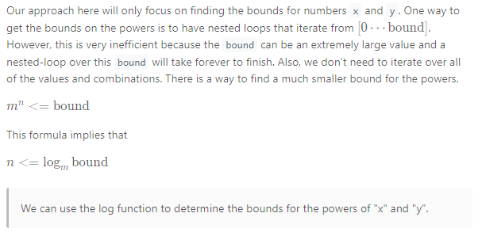
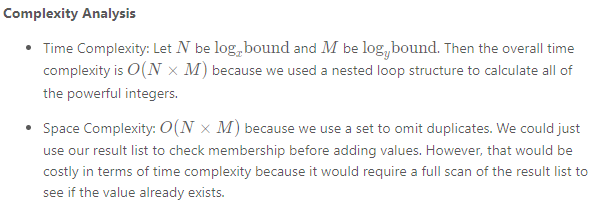

# Math

## One Liner.

| Description                      | Snippet                                             | Explaination                      |
| -------------------------------- | --------------------------------------------------- | --------------------------------- |
| To check if Double is an Integer | <code>if(d%1==0)</code>                             | if true then d is integer.        |
| To check power of any number     | <code>double temp = Math.log(n)/Math.log(2);</code> | Resultant temp should be Integer. |
| LCD of two numbers               | <code>LCM(a, b) = (a x b) / GCD(a, b)</code>        | Program for GCD is below.         |

## GCD/HCF - Euclidean Algorithm

```java showLineNumbers
public static int gcd(int a, int b)
{
    if (a == 0)
        return b;
    return gcd(b%a, a);
}
// Time Complexity: O(Log min(a, b))  
// Auxiliary Space: O(1)
```

## Sieve of Eratosthenes

```
Generating primes fast is very important in some problems.You can use the Sieve of Eratosthenes to find all the prime numbers that are less than or equal to a given number N or to find out whether a number is a prime number. The basic idea behind the Sieve of Eratosthenes is that at each iteration one prime number is picked up and all its multiples are eliminated. After the elimination process is complete, all the unmarked numbers that remain are prime.

```

## Modulo Exponentiation, Arithmetic and Inverse

```
1. (a+b)%c = (a%c+b%c)%c 
2. (a?b)%c = ((a%c)?(b%c))%c 
3. (a?b)%c = ((a%c)?(b%c)+c)%c 
4. (a/b)%c = ((a%c)?(b%c))%c 

```

## Logarithmic Bounds

    Input: x = 2, y = 3, bound = 10
    Output: [2,3,4,5,7,9,10]
    Explanation:
    2 = 20 + 30
    3 = 21 + 30
    4 = 20 + 31



➡️ So basically we are trying to find x^a+y^b where a and b are termination condition for the nested loops.

```java showLineNumbers
int a = x == 1 ? bound : (int) (Math.log(bound) / Math.log(x));
int b = y == 1 ? bound : (int) (Math.log(bound) / Math.log(y));

for (int i = 0; i <= a; i++) {
    for (int j = 0; j <= b; j++) {
        //Code here to add the numbers to the Set.
    }
}
```



## References

<ul>
<li>
<a href="https://leetcode.com/problems/powerful-integers/">Logarithmic Bounds</a>
</li>
</ul>
