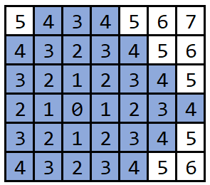

import {MyComponent} from './matrix-component.mdx';
const driver = new Driver();

# Matrix

## Manhattan Distance

This article talks about the distance between two coordinates in the plane 2D matrix.
You are given two points (x1, y1) and (x2, y2). Find the distance between them.
Allowed transition is either vertical or horizontal.

Now imagine that you are in a city, and each point is a building. You can't walk over a building, so the only options are to go either up/down or left/right. Then, the shortest distance is given by the sum of the components of the difference vector; which is the mathematical way of saying that <b>go down 2 blocks and then one block to the left</b> means walking 3 blocks' distance: <mark>dist = abs(x2-x1) + abs(y2-y1)</mark>. This is known as the Manhattan distance between the points.

