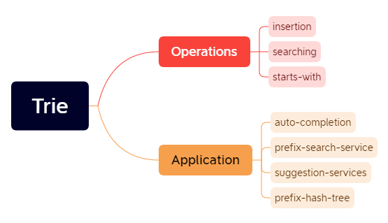
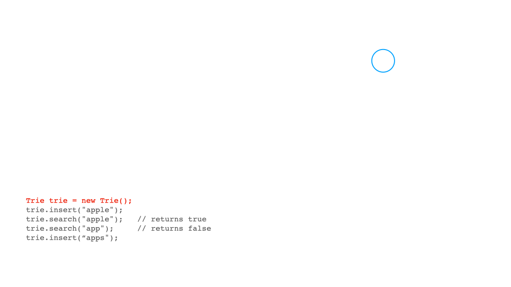

# Trie

<span class="tag-is-success">Last Updated : THURSDAY 16 June, 2022 5:19:32 PM</span>

## Introduction to Trie



A trie, or a prefix tree, is a type of search tree that is usually used to store strings. Some of the properties of Trie are:<br/>
➡️ Each path from the root to leaves forms a word.<br />
➡️ Each node except for the root node contains a value.<br />
➡️ All the descendants of a node share a common prefix associated to that node. For example, <code>are</code> and <code>art</code> share <code>ar</code> as the prefix.<br />

➡️ There are two operations provided by a trie: inserting a new string, and searching for a given string.<br />
➡️ The advantage of using a trie is that, regardless of the number of strings stored in it, the time complexity for both inserting and searching is always O(L) when L is the length of the input string.<br />

## Implementation of Trie

### General Function Calls around Trie

```
Implement a trie with insert, search, and startsWith methods.

Example:
Trie trie = new Trie();
trie.insert("apple");
trie.search("apple");   // returns true
trie.search("app");     // returns false
trie.startsWith("app"); // returns true
trie.insert("app");   
trie.search("app");     // returns true

Note:
You may assume that all inputs are consist of lowercase letters a-z.
All inputs are guaranteed to be non-empty strings.

```

### Implementation of Trie - Java

#### Define TrieNode

Firstly we need to define a class TrieNode with:

➡️ A boolean variable isWord to indicate whether we can form a word or it's only a prefix.<br />
➡️ An array of TrieNode named children to store its children node.<br />
➡️ A constructor which initializes isWord to false, and, as only lowercase letters will be used, initializes children to an array of size 26.<br />

```java showLineNumbers
class TrieNode {
    TrieNode[] children;
    boolean isEndOfWord;
    public TrieNode() {
        children = new TrieNode[26];
        isEndOfWord = false;
    }
}
```

#### Insertion into Trie

Given a new string word, we would iterate through it. Starting from the dummy node root and the first character c, we would check whether c is in root.children:

➡️ if it is, we can move to that node and increment to next character as well;<br />
➡️ if not, we need to initiate a new node so that we can attach c to the trie.<br />

```java showLineNumbers
public void insert(String word) {
    TrieNode node = root;
    for (int i = 0; i < word.length(); i++) {
        int index = word.charAt(i) - 'a';
        if (node.children[index] == null) {
            node.children[index] = new TrieNode();
        }
        node = node.children[index];
    }
    node.isEndOfWord = true;
}
//Time Complexity: O(L) where L is the length of the word.
```

#### Searching in Trie

Similarly to insert, we also start the iteration with the first character and the dummy node. If we do not find the character in its children, we can return false. Remember to check isWord after reaching the end of word.

```java showLineNumbers
public boolean search(String word) {
    TrieNode current_node = root;
    for (int i = 0; i < word.length(); i++) {
        int index = word.charAt(i) - 'a';
        if (current_node.children[index] == null) return false;
        current_node = current_node.children[index];
    }
    return current_node.isWord;
}

//Time Complexity: O(L) where L is the length of the word.
```

#### StartsWith in Trie

The only different to search is that, we do not need to check isWord at the end.

```java showLineNumbers

public boolean startsWith(String prefix) {
    TrieNode current_node = root;
    for (int i = 0; i < prefix.length(); i++) {
        int index = prefix.charAt(i) - 'a';
        if (current_node.children[index] == null) return false;
        current_node = current_node.children[index];
    }
    return true;
}
//Time Complexity: O(L) where L is the length of the prefix.

```

#### Visualization of Trie



## References

<ul>
<li>
<a href="https://medium.com/@prefixyteam/how-we-built-prefixy-a-scalable-prefix-search-service-for-powering-autocomplete-c20f98e2eff1">How We Built Prefixy: A Scalable Prefix Search Service for Powering Autocomplete</a>
</li>
</ul>
