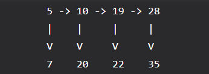

# GeeksforGeeks Microsoft Set-1

## Easy

### Celebrity problem
In a party of N people, only one person is known to everyone. Such a person may be present in the party, if yes, (s)he doesn't know anyone in the party. We can only ask questions like "does A know B? ". Find the stranger (celebrity) in the minimum number of questions.

### Print numbers in given range of BST
Given two values k1 and k2 (where k1 < k2) and a root pointer to a Binary Search Tree. Print all the keys of the tree in range k1 to k2. i.e. print all x such that k1<=x<=k2 and x is a key of given BST. Print all the keys in increasing order. 

 

### Roof to leaf path sum
Given a binary tree and a number, return true if the tree has a root-to-leaf path such that adding up all the values along the path equals the given number. Return false if no such path can be found. 

### Level order traversal
Level order traversal of a tree is breadth first traversal for the tree. 

 

### Transform to sum tree
Given a Binary Tree where each node has positive and negative values. Convert this to a tree where each node contains the sum of the left and right sub trees in the original tree. The values of leaf nodes are changed to 0.

### Delete middle of linked list
Given a singly linked list, delete the middle of the linked list. For example, if the given linked list is 1->2->3->4->5 then the linked list should be modified to 1->2->4->5

If there are even nodes, then there would be two middle nodes, we need to delete the second middle element. For example, if given linked list is 1->2->3->4->5->6 then it should be modified to 1->2->3->5->6.
If the input linked list is NULL, then it should remain NULL.

 

### K distance from root
Given a root of a tree, and an integer k. Print all the nodes which are at k distance from root. 
For example, in the below tree, 4, 5 & 8 are at distance 2 from root. 

### Find the element that appears once
Given an array where every element occurs three times, except one element which occurs only once. Find the element that occurs once. The expected time complexity is O(n) and O(1) extra space. 

### Count Occurrences of anagrams
Anagram Substring Search (Or Search for all permutations)
Given a text <mark>txt[0..n-1]</mark> and a pattern <mark>pat[0..m-1]</mark>, write a <mark>function search(char pat[], char txt[])</mark> that prints all occurrences of pat[] and its permutations (or anagrams) in txt[]. 

You may assume that <mark>n > m</mark>. Expected time complexity is <mark>O(n)</mark>

### Remove all duplicates from a given string
Given a string, remove all the duplicates and print the string. For example, if the input string is "abbbcddd", the output string should be "abcd".

## Medium

### Flattening a Linked List
Given a linked list where every node represents a linked list and contains two pointers of its type: 

- Pointer to next node in the main list (we call it 'right' pointer in the code below) 
- Pointer to a linked list where this node is headed (we call it the 'down' pointer in the code below).

All linked lists are sorted.

For example, Output for above eg:  
<mark class="pt0">5->7->10->20->19->22->28->35</mark>. 

### Program to convert a given number to words
Write code to convert a given number into words. For example, if "1234" is given as input, the output should be "one thousand two hundred thirty-four".

The code supports numbers up to 4 digits, i.e., numbers from 0 to 9999. Idea is to create arrays that store individual parts of output strings. One array is used for single digits, one for numbers from 10 to 19, one for 20, 30, 40, 50, .. etc, and one for powers of 10. 
The given number is divided into two parts: the first two digits and the last two digits, and the two parts are printed separately. 

### Longest Even Length Substring such that Sum of First and Second Half is same
Given a string 'str' of digits, find the length of the longest substring of 'str', such that the length of the substring is 2k digits and sum of left k digits is equal to the sum of right k digits. 

### Find Excel column name from a given column number
MS Excel columns have a pattern like A, B, C, …, Z, AA, AB, AC, …., AZ, BA, BB, … ZZ, AAA, AAB ….. etc. In other words, column 1 is named "A", column 2 as "B", and column 27 as "AA".
Given a column number, find its corresponding Excel column name.

If the remainder with 26 comes out to be 0 (meaning 26, 52, and so on) then we put ‘Z’ in the output string and new n becomes n/26 -1 because here we are considering 26 to be ‘Z’ while in actuality it’s 25th with respect to ‘A’.

Similarly, if the remainder comes out to be non-zero. (like 1, 2, 3, and so on) then we need to just insert the char accordingly in the string and do n = n/26.

Finally, we reverse the string and print. 

Example: 
n = 700
The remainder (n%26) is 24. So we put ‘X’ in the output string and n becomes n/26 which is 26. 
Remainder (26%26) is 0. So we put ‘Z’ in the output string and n becomes n/26 -1 which is 0.

## References

- <https://www.geeksforgeeks.org/microsofts-most-frequently-asked-interview-questions-set-2/>
- <https://www.javatpoint.com/java-program-to-remove-duplicate-characters-from-a-string>