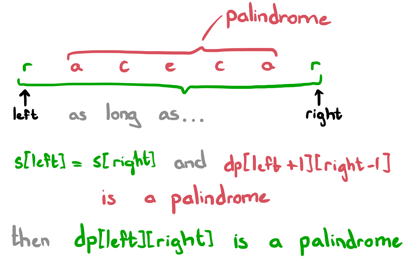
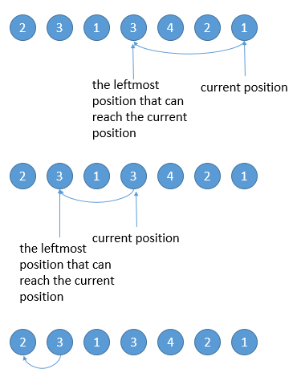

# Top 100 Liked on Leetcode 🚧

## Top coding questions from Top 100 Liked on Leetcode

The list contains all the top 100 liked problems on leetcode, but the explanation is not available for all of them, just the ones which do not popup into head just by looking into them or which might be useful for you.

<div class="top100-liked-leetcode-container">
<div class="top100-liked-leetcode-item pl0">

### Two Sum

```java
public int[] twoSum(int[] nums, int target);
```

<span class="tag-is-success">Array</span>
<span class="tag-is-success">Hash Table</span>

</div>
<div class="top100-liked-leetcode-item pl0">

### Add Two Numbers

```java
public Node addTwoNumbers(Node l1, Node l2);
```

<span class="tag-is-success">Linked List</span>
<span class="tag-is-success">Math</span>
<span class="tag-is-success">Recursion</span>

</div>
</div>
<hr/>
<div class="top100-liked-leetcode-container">
<div class="top100-liked-leetcode-item pl0">

### 3Sum

```java
public List<List<Integer>> threeSum(int[] nums);
```

<span class="tag-is-success">Array</span>
<span class="tag-is-success">Set</span>

</div>
<div class="top100-liked-leetcode-item pl0">

### Letter Combinations of a Phone Number

```java
public List<String> letterCombinationsBackTrack(String digits);
```

<span class="tag-is-success">Queue</span>
<span class="tag-is-success">HashMap</span>

</div>
</div>
<hr/>
<div class="top100-liked-leetcode-container">
<div class="top100-liked-leetcode-item pl0">

### Remove Nth Node From End of List

```java
public ListNode removeNthFromEnd(ListNode head, int n);
```

<span class="tag-is-success">Linked List</span>
<span class="tag-is-primary">Reverse Linked List</span>

</div>

<div class="top100-liked-leetcode-item pl0">

### Valid Parentheses

```java
public boolean isValid(String s);
```

<span class="tag-is-success">Stack</span>

</div>
</div>
<hr/>
<div class="top100-liked-leetcode-container">
<div class="top100-liked-leetcode-item pl0">

### Merge Two Sorted Lists

```java
public ListNode mergeTwoLists(ListNode l1, ListNode l2);
```

<span class="tag-is-success">Linked List</span>

</div>
<div class="top100-liked-leetcode-item pl0">

### Merge k Sorted Lists

```java
public ListNode mergeKLists(ListNode[] lists);
```

<span class="tag-is-success">PriorityQueue</span>

</div>
</div>
<hr/>
<div class="top100-liked-leetcode-container">
<div class="top100-liked-leetcode-item pl0">

### Search in Rotated Sorted Array

```java
public int search(int[] nums, int target);
```

<span class="tag-is-success">Binary Search Variation</span>

</div>
<div class="top100-liked-leetcode-item pl0">

### Find First and Last Position of Element in Sorted Array

```java
public int[] searchRange(int[] nums, int target);
```

<span class="tag-is-success">Binary Search Variation</span>

</div>
</div>
<hr/>
<div class="top100-liked-leetcode-container">
<div class="top100-liked-leetcode-item pl0">

### Search Insert Position

```java
public int searchInsert(int[] nums, int target);
```

<span class="tag-is-success">Binary Search Variation</span>

</div>
<div class="top100-liked-leetcode-item pl0">

### Combination Sum

```java
public List<List<Integer>> combinationSum(int[] a, int t);
```

<span class="tag-is-success">DFS</span>

</div>
</div>
<hr/>
<div class="top100-liked-leetcode-container">
<div class="top100-liked-leetcode-item pl0">

### Permutations

```java
public List<List<Integer>> permute(int[] nums);
```

<span class="tag-is-success">DFS</span>
<span class="tag-is-success">SWAP</span>

</div>

</div>

<hr />
<div class="top100-liked-leetcode-container">
<div class="top100-liked-leetcode-item pl0">

### Longest Substring Without Repeating Characters

Given a string s, find the length of the longest substring without repeating characters.

```java showLineNumbers
public int lengthOfLongestSubstring(String s);

Input: s = "abcabcbb"
Output: 3 ("abc")
```

<span class="tag-is-success">Hash Table</span>
<span class="tag-is-success">String</span>
<span class="tag-is-success">Sliding Window</span>

</div>
<div class="top100-liked-leetcode-item">

```java
The idea behind solving the problem is very simple, we need to keep track of the characters we have seen so far and the length of the substring.

The same can be achieved with usage of Set and a pointer to keep track of the start of the substring, and along with that we can use sliding window method to check the current length of the longest substring.
```

</div>
</div>

<hr />
<div class="top100-liked-leetcode-container">
<div class="top100-liked-leetcode-item pl0">

### Median of two Sorted Arrays

Given two sorted arrays nums1 and nums2 of size m and n respectively, return the median of the two sorted arrays.
The overall run time complexity should be O(log (m+n)).

```java showLineNumbers
public double findMedianSortedArrays(int[] nums1, int[] nums2);
```

<span class="tag-is-success">Array</span>
<span class="tag-is-success">Binary Search</span>
<span class="tag-is-success">Divide and Conquer</span>

</div>
<div class="top100-liked-leetcode-item">

```java
Main idea behind finding the median for a 1D array is that you keep on removing the min and the max element from the array until you are either left with 1 or two elements in the array. You can apply the same concept here with using four pointers to keep track of the start end for both the sorted array.
```

</div>
</div>

<hr />
<div class="top100-liked-leetcode-container">
<div class="top100-liked-leetcode-item pl0">

### Longest Palindromic Substring

Given a string s, return the longest palindromic substring in s.

```java
public String longestPalindrome(String s);
```

<span class="tag-is-success">String</span>
<span class="tag-is-success">Dynamic Programming</span>



</div>
<div class="top100-liked-leetcode-item">

```java
The DP approach to this question is quite simple actually! For any given substring, we can confirm if it is a palindrome in O(1) time if:

The characters at the ends of the substring are the same.
If the inner substring is a palindrome.
Which will be represented by dp[i][j] = dp[i+1][j-1] && s.charAt(i) == s.charAt(j). So the dp matrix you can imagine will look like all the true value in the diagonal center as it denotes the palindrome of a single character and all the down cells to this diagonal will be false because they represent the particular length in reverse order which we don't want.

Like wise we will be calculating the values for the top of diagonal section of the matrix. And there for every cell we would need the left-down diagonal value to be calculated first which is represented by dp[i+1][j-1].
```

</div>
</div>

<hr />
<div class="top100-liked-leetcode-container">
<div class="top100-liked-leetcode-item pl0">

### Container With Most Water

You are given an integer array height of length n. There are n vertical lines drawn such that the two endpoints of the ith line are (i, 0) and (i, height[i]).

Find two lines that together with the x-axis form a container, such that the container contains the most water.

Return the maximum amount of water a container can store.

```java
public ListNode addTwoNumbers(ListNode l1, ListNode l2);
Input: height = [1,8,6,2,5,4,8,3,7] Output: 49
```

<span class="tag-is-success">Array</span>
<span class="tag-is-success">Two Pointers</span>
<span class="tag-is-success">Greedy</span>

</div>
<div class="top100-liked-leetcode-item">

```java
The idea is to maximize the distance between the two bars and for that we can take two pointers start and end. We will calculate the area by taking the minimum of the two heights and multiply it with the difference between the two pointers. 

And for moving the pointers we will check wether the value at the start is less or higher that the value at the end index.
```

</div>
</div>

<hr />
<div class="top100-liked-leetcode-container">
<div class="top100-liked-leetcode-item pl0">

### Rotate Image

You are given an n x n 2D matrix representing an image, rotate the image by 90 degrees (clockwise).

You have to rotate the image in-place, which means you have to modify the input 2D matrix directly. DO NOT allocate another 2D matrix and do the rotation.

```java
public void rotate(int[][] matrix);
Input: matrix = [[1,2,3],[4,5,6],[7,8,9]]
Output: [[7,4,1],[8,5,2],[9,6,3]]
```

<span class="tag-is-success">Array</span>
<span class="tag-is-success">Math</span>
<span class="tag-is-success">Matrix</span>

</div>
<div class="top100-liked-leetcode-item">

```java
If you know some about Math, then we know that the Rotation is actually a process which is combination of Transpose and Reverse the Matrix. So Transposing means we swap the value diagonally and Reverse the matrix means we reverse the rows assuming each row as 1D Matrix.
```

</div>
</div>
<hr />
<div class="top100-liked-leetcode-container">
<div class="top100-liked-leetcode-item pl0">

### Jump Game II

Given an array of non-negative integers nums, you are initially positioned at the first index of the array.Each element in the array represents your maximum jump length at that position.Your goal is to reach the last index in the minimum number of jumps.

You can assume that you can always reach the last index.

```java
public int jump(int[] A);
```

<span class="tag-is-success">Dynamic Programming</span>
<span class="tag-is-success">Array</span>
<span class="tag-is-success">Greedy</span>



</div>
<div class="top100-liked-leetcode-item">

```java
One quick solution for the problem is that stand at the end position and check if you can reach the current position from left, meaning Find the leftmost position that can reach the current position.

public int jump(int[] nums) {
    int position = nums.length - 1;
    int steps = 0;
    while (position != 0) {
        for (int i = 0; i < position; i++) {
            if (nums[i] >= position - i) {
                position = i;
                steps++;
                break;
            }
        }
    }
    return steps;
}
TC: O(n) But for the worst case we can have a O(n^2).
To avoid that we can add an extra check at the start like below.

if len(set(nums)) < 2:
    return math.ceil((len(nums)-1)/(nums[0])) if nums and nums[0] else 0

SC: O(1) but will take O(n) if we are checking for the second part.
```

</div>
</div>

<hr />
<div class="top100-liked-leetcode-container">
<div class="top100-liked-leetcode-item pl0">

### Longest Valid Parentheses

Given a string containing just the characters '(' and ')', find the length of the longest valid (well-formed) parentheses substring.

```java
public int longestValidParentheses(String s);
Input: s = "(()" Output: 2
```

<span class="tag-is-success">Dynamic Programming</span>
<span class="tag-is-success">String</span>
<span class="tag-is-success">Stack</span>

</div>
<div class="top100-liked-leetcode-item">

```java
The idea is to traverse the string from left to right and keep track of the number of opening and closing parentheses. If open==close then we know that this is the valid sequence and if they are not equal then we reinitialize the count of both open and close to 0. Likewise repeat the process by iterating the string from right to left.

```

<details>
  <summary>Solution - Twice Iteration</summary>
  <div>

```java showLineNumbers
class Solution {
    public int longestValidParentheses(String s) {
        int max=0;
        int open = 0, close=0;
        for(int i=0;i<s.length();i++){
            if(s.charAt(i) == '(') open++;
            else close++;
            if(open == close){
                max = Math.max(max, open*2);
            }else if(close>open){
                open = close = 0;
            }
        }
        
        open = close=0;
        for(int i=s.length()-1;i>=0;i--){
            if(s.charAt(i) == '(') open++;
            else close++;
            if(open == close){
                max = Math.max(max, open*2);
            }else if(close<open){
                open = close = 0;
            }
        }
        return max;
    }
}
TC: O(n)
SC: O(1)
```

</div>
</details>

```java
Using stack also we can solve the problem. We keep track of checking whether the string scanned so far is a valid one and also the length of the longest valid string. In order to do so, we start by pushing -1 onto the stack. For every '(' encountered, we push its index onto the stack.
For every ')' encountered, we pop the topmost element. Then, the length of the currently encountered valid string of parentheses will be the difference between the current element's index and the top element of the stack.

```

<details>
  <summary>Solution - Stack</summary>
  <div>

```java showLineNumbers
class Solution {
    public int longestValidParentheses(String s) {
        int max=0;
        int open = 0, close=0;
        for(int i=0;i<s.length();i++){
            if(s.charAt(i) == '(') open++;
            else close++;
            if(open == close){
                max = Math.max(max, open*2);
            }else if(close>open){
                open = close = 0;
            }
        }
        
        open = close=0;
        for(int i=s.length()-1;i>=0;i--){
            if(s.charAt(i) == '(') open++;
            else close++;
            if(open == close){
                max = Math.max(max, open*2);
            }else if(close<open){
                open = close = 0;
            }
        }
        return max;
    }
}
TC: O(n)
SC: O(n) As we are using Stack for the storage.
```

</div>
</details>

</div>
</div>

## References

<ul>
<li>

<https://leetcode.com/problem-list/top-100-liked-questions/>

</li>

</ul>
