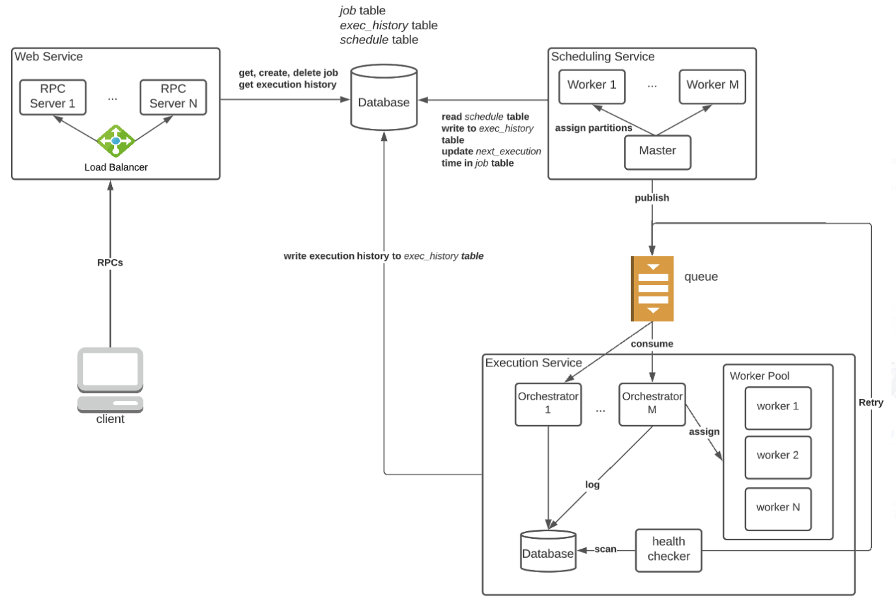
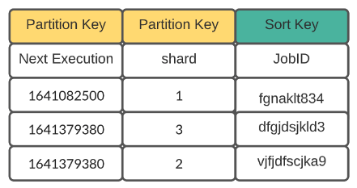
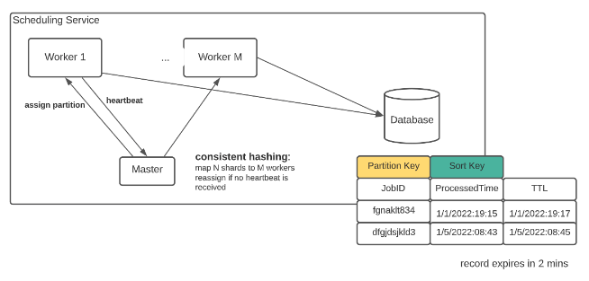
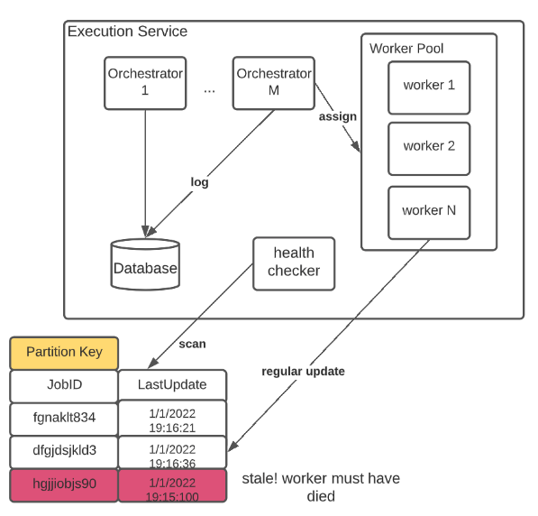

# Job Scheduling System

## Introduction and Requirements

### Introduction

When a limit-sell order or some code is scheduled to run in the future, you need a piece of software like Apache Airflow that runs tasks when certain conditions are met. Because of its wide popularity in the industry, job scheduler has been among the top topics of system design interviews.

### Requirements

In an interview, it is critical to lay down concretely the desired features of the system. No one can design a full-fledged system in an hour, so narrow the topic as much as possible! For the simplicity of the discussion, I'm going to focus on the core features of job schedulers:

1.  Create/delete a new job with its schedule
2.  Query all jobs owned by the user
3.  Query the status of a job (running, failed, finished, etc)
4.  Query the execution history of a job
5.  Retry support for failed tasks
6.  On-time execution (when a job is scheduled to run at 1 PM, it should be triggered around 1 PM)

Needless to say, the system should be horizontally scalable and highly available.

## Traffic Estimation

The traffic that hits a job scheduler varies in different applications. For internal-use schedulers, the traffic is small as the number of users is limited by the team size. On the other hand, client-facing schedulers can be bombarded with tons of traffic (such as schedulers in AWS). In this article, we assume the traffic is large for better generalization:

1.  We expect millions of active users.
2.  On average, each active user owns dozens of recurring jobs.
3.  On average, an active user creates a couple of new jobs per week.
4.  A large percentage of jobs repeat every day for a few times. Some jobs are executed with longer intervals.

Based on the estimations above, we can make the following conclusions:

1.  The backend database should be horizontally scalable, as the execution history grows quickly (~ 100 million rows of data created every day).
2.  The system is read-heavy, as a job is created once and read many times by the scheduler. The same holds true for execution history, an entry is created and can be queried many times by the user.
3.  We need a distributed group of workers to run jobs concurrently with varying capabilities.
4.  All critical services should be replicated to handle the large traffic.

## High Level Design

### Database Design

In database design, the access pattern of your application determines what schema is used. Let's investigate the requests that hit the database:

#### Read Operations

1.  Given a user ID, retrieve all jobs that belong to it (by client)
2.  Given a job ID, retrieve all/latest execution histories belonging to it (by client)
3.  Find all jobs that are scheduled to run right now (by internal servers)

Write Operations

1.  A user can create/delete a new job schedule (by client).
2.  The workers will add execution histories to the database (by internal servers).
3.  The system updates the next execution timestamp of a job after running it (by internal servers).

In our use case, complex relational queries are not used. Most data access can be described as primary-key queries (e.g. given a job ID, get all executions). Also, the issues of strong consistency and transactions are not of paramount importance. 

Hence, both sharded SQL and NoSQL databases can handle all the requirements of the system as long as they are tuned for reads. For simplicity, I'm going to use NoSQL (Cassandra) language in the schema discussions, but please remember that you can choose other databases like Postgres or HBase.

### Database Schema

#### Job Table

We need a table that keeps track of job metadata such as owners, execution intervals, and retry policies. Remember the access pattern for this table: given a user ID, get some job records. Hence, we can use UserID as the partition key, and JobID as the sort key

| Column Name | Type     |
| ----------- | -------- |
| JobID       | String   |
| UserID      | String   |
| Interval    | Integer  |
| RetryTimes  | Integer  |
| Status      | String   |
| CreatedAt   | DateTime |

#### History Table

This table is used to store execution details of a job. Given a job, there could be multiple executions associated with it. Remember the access pattern: given a JobID, retrieve all execution histories. Hence, we use JobID as the partition key and execution ID as the sort key (the execution ID can be a simple timestamp).

| Column Name | Type     |
| ----------- | -------- |
| JobID       | String   |
| ExecutionID | String   |
| Status      | String   |
| WorkerID    | String   |
| RetryCount  | Integer  |
| CreatedAt   | DateTime |

#### Schedule Table

 The core feature of any job scheduler is, of course, running jobs on time. Therefore, we need a data model that makes it easy to filter jobs by execution time. Here JobID is treated as the Partition Key and ExecutionTime as the Sort Key. Here is a simple design that works well for a small amount of data:

| Column Name   | Type     |
| ------------- | -------- |
| JobID         | String   |
| ExecutionTime | DateTime |
| Status        | String   |

To get the list of to-dos, we can simply run a query like this every minute:

<mark>SELECT \* FROM ScheduleTable WHERE NextExecution == "1/5/2022:08:43"</mark>

One huge issue with the current design is that each query triggers a table scan. If the data is large, additional mechanisms are needed to ensure the scalability of the system. See more in the Details section.

If you have experience with large-scale databases, the word table scan should alarm you, not to mention doing it every minute. Is there a way to filter jobs without checking every record? Yes! If we simply reverse the data model.

<mark>Make ExecutionTime as the Partition Key and JobID as Sort Key.</mark>

Note that the execution time is converted to UNIX timestamp with minute-lev el granularity. This means that jobs that are scheduled to run in the same minute will share the same partition key. To get jobs that are scheduled to run right now, simply find the right partition with the current UNIX timestamp:

<mark>SELECT \* FROM ScheduleTable WHERE NextExecution > "1641082500" AND NextExecution &lt; "1641082580"</mark>

### API Design

Our application is easy to use, it only needs the following RPC interfaces:

<mark>submit_job(user_id, schedule, code_location)</mark>
<mark>retrieve_all_jobs(user_id)</mark>
<mark>delete_job(user_id, job_id)</mark>
<mark>get_exec_history(job_id)</mark>

### Architecture

By now we’ve laid down a solid foundation for the application — the database schema, the RPC calls. Now is prime time to do some service-oriented designs!

#### Web Service:

The gateway to the scheduling system. All RPC calls from the client are handled by one of the RPC servers in this service.

#### Scheduling Service:

It checks the database every minute for pending jobs and pushes them to a queue for execution. Once a job is scheduled, create an entry in the execution history table with status = SCHEDULED. With this service, we guarantee that all jobs are pushed to the queue in a timely manner.

#### Execution Service:

In this service, we manage a large group of execution workers. Each worker is a consumer and executes whatever jobs it gets from the queue. Additional bookkeeping is needed to ensure re-execution upon worker failures.

## Details

If you see the figure above in detail, you might be wondering about the purpose of the master in the Scheduling Service or the health checker in the Execution Service. In this section, we are going to discuss the necessity of these components and why do they work.

### Run tasks on schedule

Let’s examine the query statement again:
<mark>SELECT \* FROM ScheduleTable WHERE NextExecution > "1641082500" AND NextExecution &lt; "1641082580"</mark>

When the number of jobs running concurrently is small, the query yields a reasonable amount of data. However, if, let’s say, 100K jobs are scheduled to run in this minute, we certainly need more workers to handle the ingress data from the query as well as push messages to the queue.

The complexity arises when multiple workers are introduced — How can we distribute the data so that each worker only consumes a small fraction (10%) of the 100K jobs? It turns out that a simple composite partition key can fix this issue:

When a row is added to the schedule table, it is randomly assigned a shard number. With the new schema, it is super easy to distribute the load across workers:

<mark>
    Worker 1: 
    SELECT * FROM ScheduleTable WHERE NextExecution &gt; "1641082500" AND NextExecution &lt; "1641082580" AND shard =1 
    Worker 2:
    SELECT * FROM ScheduleTable WHERE NextExecution &gt; "1641082500" AND NextExecution &lt; "1641082580" AND shard = 2
    ...
</mark>

Although the additional partition key makes it easy to shard data, there is another wrinkle — workers come and go all the time. There is no guarantee that all shards will be covered. The problem becomes how can we assign N shards evenly to M workers, where M can change at any time?

To make sure a complete work assignment, we can borrow some ideas from MapReduce, where a master is used to assign and monitor workers. If a worker dies, the master will resend its work to some other nodes. An additional local database is used so that no job is scheduled twice. When a job is pushed to the queue, an entry is created in the local DB with 2 minutes of expiration time. If the original handler of the record dies and the shard is handed over to another worker, the new worker will skip tasks that exist in the database.

### Queue delivery

A queue is introduced for two reasons. Firstly, we want a buffer that holds all pending jobs at peak hours. Secondly, it decouples the two services. The execution service can increase/decrease its capacity without coordination with the scheduling service. However, with the additional middleware, we must consider what type of delivery works best for the system (Assume the queue is implemented in Kafka).

#### At-least-once delivery

In this mode of delivery, messages are processed before their indices are committed by the consumer. If the consumer dies before committing, the same message will be processed again by a different worker.

#### At-most-once delivery

In this mode of delivery, messages are processed after their indices are committed by the consumer. If the consumer dies before finishing the task, the job won’t be reprocessed.

In our application, at-least-once delivery is more fault-tolerant and makes it easy to retry failed tasks upon orchestrator failure. A message (job) is committed only when the orchestrator successfully starts a container on one of the workers.

### Handling failures & Retries

Although at-least-once delivery guarantees that every job gets assigned to a worker, it does not prevent jobs from getting dropped upon worker failure. To achieve true retry capability, an asynchronous health checker is introduced to run the following logic:

1.  When a job is assigned, an entry is created in the local database with the latest update time.
2.  All workers are required to refresh the update time ~10s.
3.  The health checker will periodically scan the table, looking for jobs with stale update time (e.g. older than 30 seconds).
4.  Jobs that meet the above criteria are sent back to the queue for re-execution.

## Data Flow

With all the wrinkles in the high-level design address, we can finally come up with the data flow of the system:

### Create/delete job/Retrieve history

1.  The client sends out an RPC call to Web Service.
2.  One of the RPC servers queries the database using the provided partition key and return the result.

### Schedule a job

#### Master

1.  Every minute, the master node creates an authoritative UNIX timestamp and assigns a shard ID (see details for more) to each worker along with the timestamp
2.  Check worker health regularly. If it dies, reassign its work to others

#### Worker

1.  The worker queries the database with the timestamp and shard ID.
2.  For each row, send it to the queue if it has not been scheduled (see details for more)

### Execute a job

#### Orchestrator

1.  A group of orchestrators consumes messages from the queue
2.  Given a message, find one worker with the least workload. Assign the job to the worker
3.  Commit the index, repeat steps 1 to 3

#### Worker

The worker regularly update the local database with its timestamp

#### Health Checker

1.  Scans the local database ~ 10 seconds
2.  If any row hasn’t been updated in ~30 seconds, retry it by pushing the job ID to the queue

## References

-   <https://towardsdatascience.com/ace-the-system-design-interview-job-scheduling-system-b25693817950>
