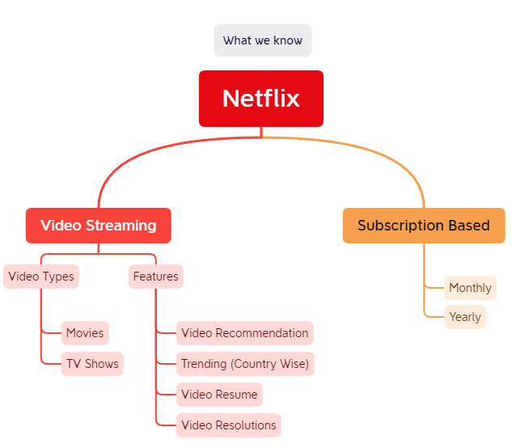
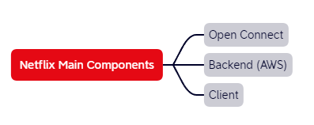
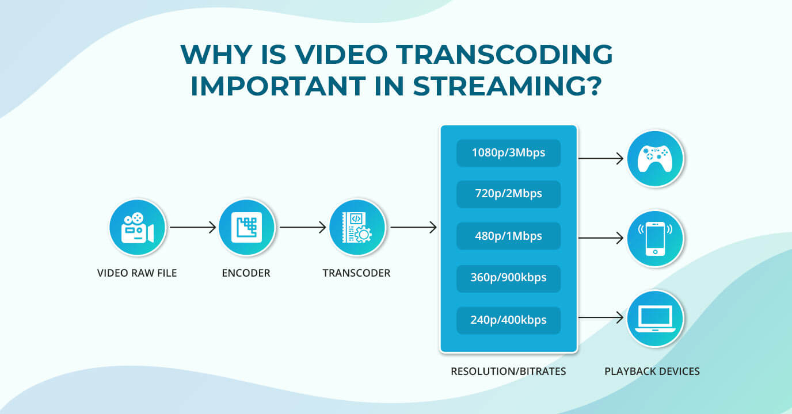
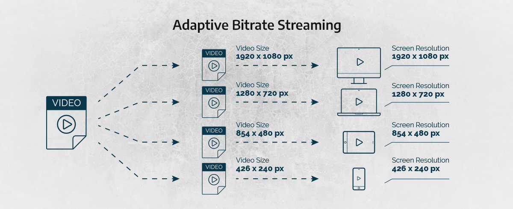

# Netflix System Design

## What we know so far

## Components of Netflix

### Open Connect

➡️ This is kind of Netflix owned CDN. All the process related to the Streaming of the Video to Client is handled by this component. 

### What is Transcoding

|                                 Transcoding                                |                                                                                                                                                                                                              Description                                                                                                                                                                                                             |
| :------------------------------------------------------------------------: | :----------------------------------------------------------------------------------------------------------------------------------------------------------------------------------------------------------------------------------------------------------------------------------------------------------------------------------------------------------------------------------------------------------------------------------: |
|  | ➡️ Netflix breaks the original(onboarding) video into different smaller chunks and using parallel workers in AWS EC2, it performs encoding and transcoding on these chunks converting them into different formats (MP4, MOV, etc) across different resolutions(4k, 1080p, and more). ➡️ Everything chunk is then merged and the copies of those are stored in the AMAZON S3 bucket and later are pushed to the Open Connect Servers. |

### What is Adaptive Bitrate Streaming

|                             Adaptive Bitrate Streaming                            |                                                                                                                                                                                                                                             Description                                                                                                                                                                                                                                             |
| :-------------------------------------------------------------------------------: | :-------------------------------------------------------------------------------------------------------------------------------------------------------------------------------------------------------------------------------------------------------------------------------------------------------------------------------------------------------------------------------------------------------------------------------------------------------------------------------------------------: |
|  | ➡️ Netflix handles the onboarding of a new video to the system in such a way that its first transcoded into different codecs along with different resolutions. So that the video can be played in different resolutions and bitrates and be targetted to maximum devices and browsers.➡️ <strong>Adaptive Bitrate Streaming</strong> is the process when video running at lesser resolution due to lower internet bandwidth is switched to higher resolution when internet bandwidth is normalized. |

### Backend

➡️ Anything that is not involved in the Video Streaming is handled at the AWS. 
➡️ For example Billing, Customer Support, Listing of Movies and TV Shows, etc. 
➡️ All the user viewing pattern, search analytics, etc. are handled at the backend and are stored in AWS and various ML models are used to predict the user's behavior, So that next time a better recommendation will be served to the user.  

#### Microservices

➡️Microservices are key to powering the Netflix API infrastructure, as a user request comes in the call is made to any endpoint, moves on to the other end points through an iterative process. 

➡️The microservices can be distributed across different instances using HTTP or Remote Procedure Calls (RPC). 

➡️The common issue with a microservice-powered system is any node can fail and the entire system can cascade into failure, how do we control this? 

➡️As mentioned above one way is the hystrix algorithm which isolates end points and the other is reducing dependencies on vital nodes. 

➡️<code>Critical Services</code>With software engineering we should always look at the best and worst case, a system like Netflix crashing should mean at least basic functionalities are available for clients.Critical endpoints such as search, play, navigation should always be allocated less dependencies. 

➡️<code>Stateless</code>Another key feature in a failsafe microservice system has stateless endpoints, if an endpoint is down then the user should get a response from any other node/endpoint. 

### Client

➡️ Any device from which you play Netflix Video. 

### ZUUL

    Zuul is the front door for all requests from devices and web sites to the backend of the Netflix streaming application. As an edge service application, Zuul is built to enable dynamic routing, monitoring, resiliency and security.

    Routing is an integral part of a microservice architecture. For example, /api/users is mapped to the user service and /api/shop is mapped to the shop service. Zuul is a JVM-based router and server side load balancer by Netflix.

Zuul uses a range of different types of filters that enables us to quickly and nimbly apply functionality to our edge service. These filters help us perform the following functions: 

➡️ <strong>Authentication and Security</strong>: identifying authentication requirements for each resource. 
➡️ <strong>Insights and Monitoring</strong>: tracking meaningful data and statistics. 
➡️ <strong>Dynamic Routing</strong>: dynamically routing requests to different backend.. 
➡️ <strong>Stress Testing</strong>: gradually increasing the traffic. 
➡️ <strong>Load Shedding</strong>: allocating capacity for each type of request and dropping requests. 
➡️ <strong>Static Response handling</strong>: building some responses directly. 
➡️ <strong>Multi-region Resiliency</strong>: routing requests across AWS regions. 

Zuul gives us a lot of insight, flexibility, and resiliency, in part by making use of other Netflix OSS components:

➡️<strong>Hystrix</strong> is used to wrap calls to our origins, which allows us to shed and prioritize traffic when issues occur. Hystrix is a latency and fault tolerance library designed to isolate points of access to remote systems, services and 3rd party libraries, stop cascading failure and enable resilience in complex distributed systems where failure is inevitable. 

#### Hystrix as a Circuit Breaker

As you said, it can be simply wrapped under try-catch block then why choose Hystrix or some other library? What i experienced:

<ul>
    <li>Already <code>test proven</code> library.</li>
    <li>Ability to <code>skip original intended calls and fallback</code>. Note that if you wrap it under try-catch, there will be still be an attempt to connect and send command which will eventually timeout due to degraded dependency. Knowing this information prior to call will enable to skip the calls for sometime (as per configuration) and you can save those resources</li>
    <li>Provides circuit breaking using <code>Sliding Time Window</code> as well</li>
    <li><code>Metrics and Dashboarding</code> provided Out of the Box which can help you peek into your system and dependent connection</li>
    <li>Implements <code>BulkHead</code> by using different <code>Thread Pools</code></li>
    <li>Lower maintenance cost</li>
    <li>Health check ability. It provides a health check class which plugins with Health monitoring APIs</li>
</ul>

<strong>What does it do?</strong>

<ul>
    <li><strong>Latency and Fault Tolerance</strong> : Stop cascading failures. Fallbacks and graceful degradation. Fail fast and rapid recovery.Thread and semaphore isolation with circuit breakers.</li>
    <li><strong>Realtime Operations</strong>Realtime monitoring and configuration changes. Watch service and property changes take effect immediately as they spread across a fleet.Be alerted, make decisions, affect change and see results in seconds.</li>
    <li><strong>Concurrency</strong>Parallel execution. Concurrency aware request caching. Automated batching through request collapsing.</li>
</ul>
➡️<strong>Ribbon</strong> is our client for all outbound requests from Zuul, which provides detailed information into network performance and errors, as well as handles software load balancing for even load distribution. 
➡️<strong>Turbine</strong> aggregates fine­grained metrics in real­time so that we can quickly observe and react to problems. 
➡️<strong>Archaius</strong> handles configuration and gives the ability to dynamically change properties. 

## References

<ul>
    <li><a href="https://www.youtube.com/watch?v=psQzyFfsUGU">Youtube - Tech Dummies Narendra L - Netflix System Design</a></li>
    <li><a href="https://dzone.com/articles/spring-cloud-netflix-zuul-edge-serverapi-gatewayga">Get to Know Netflix's Zuul</a></li>
    <li><a href="https://github.com/Netflix/Hystrix">Hystrix - Github</a></li>
    <li><a href="https://www.muvi.com/blogs/importantance-of-video-transcoding.html">Importance of Video Transcoding</a></li>
</ul>
