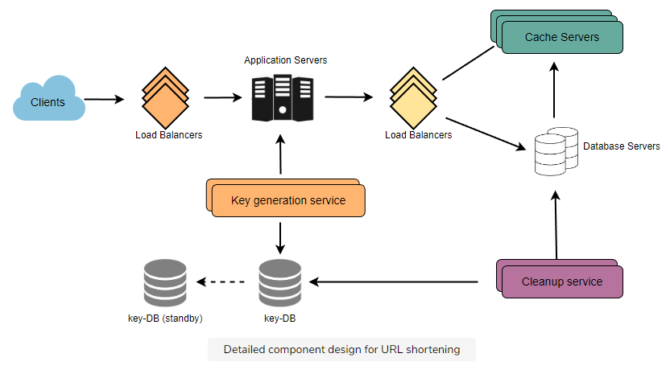

# Tinyurl System Design

## Introduction to Tinyurl

### What is tinyurl?

tinyurl is a URL service that users enter a long URL and then the service return a shorter and unique url. The highlight part can be any string with 6 letters containing [0-9, a-z, A-Z]. 

    62^6 ~= 56.8 billions unique strings.

### How it works?

Basically user comes to your service with a long URL and our service returns a short URL. Users are redirected to the original URL when they hit these short links. Short links save a lot of space when displayed, printed, messaged, or tweeted.

### Why do we need services like tinyurl?

Services like tinyurl are used to shorten long URLs. This is a great way to share links with your friends. Additionally, users are less likely to mistype shorter URLs.

URL shortening is used to optimize links across devices, track individual links to analyze audience, measure ad campaigns' performance, or hide affiliated original URLs.

### Are there existing services like tinyurl?

Yes there are many existing services like tinyurl. It depends upon the provider and the functionality provided by the service. Some of the free services alternative are : bit.ly, ow.ly, short.io

## Glossary for Tinyurl System Design

This section will contains short introduction to all the terminologies that will be used for this particular system design. Further we will discuss more in details for the same topics or concepts. This will help you to look over concepts and map of the system.

### Requirements and Goals of the System

We will talk about the functional, non-functional and architectural requirements of the system. Functional requirements is description of the services and features that the system must offer. 

Non-functional requirements specifies criteria that can be used to judge the operation of a system, rather than specific behaviors. Non-functional requirements helps you verify the performance of the system. 

We will also discuss what extra features or constraints we can add to the system. These will be like good to have features, which will drive users to use the system.

### Capacity Estimation and Constraints

Finding out whether our system is read/write heavy. On the basis of that we will be calculating different variables for the system like traffic, storage, bandwidth, memory, etc. estimations. This generally helps in building a system that is efficient and scalable. 

This is important part of the system design. With the help of these estimation we will be able to build a system that will be supporting multiple users and will be able to scale up and down. 

This step also helps us to build a system that is fault tolerant and what are the hardware requirements for the system at the initial stage itself.

### System APIs

This section will contain all the APIs that will be used by the system or will be provided by the system as a service. This is the core of the system design. Everything that the system is able to do or talk to database, network, etc. would be done thinking of APIs as the middleware. 

This should explicitly state what is expected from the system. We can have SOAP or REST APIs to expose the functionality of our service. Many of the security vulnerabilities are taken care at this stage. For eg. Rate Limiter, Authentication, Encryption, etc.

### Database Design

Choosing where your data lies is also important step of the system design. Which one to prefer among (SQL or NoSQL), which perfectly fits your system's requirements. In case of read heavy system, SQL is the best choice. 

In case of write heavy system, NoSQL is the best choice. Will help you decide upon the storage estimation and different db operations to be done on the system. 

In this section will also study about the schema of the database. This will help us in deciding what kind of data will be stored in the db and what is the relationship between the tables.

### Data Partitioning and Replication

Once you build the system, and once your system is ready to use, more and more users will be using your services or system or worst case users count will drop. We need to have a mechanism where we can scale up or down the system. 

To scale out our DB, we need to partition it so that it can store information about billions of URLs. Therefore, we need to develop a partitioning scheme that would divide and store our data into different DB servers.

### Purging or DB Cleanup

Should entries stick around forever, or should they be purged? If a user-specified expiration time is reached, what should happen to the link?
Should there be any expiration date on the entries for the database, say like 6-months for our current system. 

This step will be talking about removing dead entries or entries which has reached their expiration. Different methodologies can be used to achieve this step efficiently.

### Basic Design and Algorithm

The problem we are solving here is how to generate a short and unique key for a given URL. What is the algorithm that we will be using to generate this tiny hash of some kind. How many of them do we need to survive or fulfill user needs for certain years. 

Generating hash using some algorithm and making sure that it is unique. What is the length of the hash that we need to generate.

### Cache

Accessing frequent data to minimize the travel time for the user which is minimizing the latency for the system, we use cache. What are the different techniques that we can use to cache the data. How much memory do we need to cache the data. 

What are the cache eviction policies that we need to follow to keep the cache size in check, so that we can replace the older entries with the newer ones. To further increase the efficiency, we can replicate our caching servers to distribute the load between them.

### Load Balancer

Load balancer is a system that will help us to distribute the load between the servers. We can use different load balancer techniques like round robin, least loaded, etc. We can add load balancing layer at three places for our system:

    1. Between Clients and Application servers
    2. Between Application Servers and database servers
    3. Between Application Servers and Cache servers

### Telemetry

This is basically tracking the usage of our system, kind of like analytics. How many times a short URL has been used, what were user locations, etc.? How would we store these statistics?

Some statistics worth tracking: country of the visitor, date and time of access, web page that referred the click, browser, or platform from where the page was accessed.

### Security and Permissions

Can users create private URLs or allow a particular set of users to access a URL?

We can store the permission level (public/private) with each URL in the database. We can also create a separate table to store UserIDs that have permission to see a specific URL. If a user does not have permission and tries to access a URL, we can send an error (HTTP 401) back. 

Given that we are storing our data in a NoSQL wide-column database like Cassandra, the key for the table storing permissions would be the 'Hash' (or the KGS generated 'key'). The columns will store the UserIDs of those users that have permission to see the URL.

## Requirements and Goals of the System

Our URL shortening system should meet the following requirements:

<strong>Functional Requirements:</strong>

1.  Given a URL, our service should generate a shorter and unique alias of it. This is called a short link. This link should be short enough to be easily copied and pasted into applications.
2.  When users access a short link, our service should redirect them to the original link.
3.  Users should optionally be able to pick a custom short link for their URL.
4.  Links will expire after a standard default time-span. Users should be able to specify the expiration time.

<strong>Non-Functional Requirements:</strong>

1.  The system should be highly available. This is required because, if our service is down, all the URL redirection will start failing.
2.  URL redirection should happen in real-time with minimal latency.
3.  Shortened links should not be guessable (not predictable).

<strong>Extended Requirements:</strong>

1.  Analytics; e.g., how many times a redirection happened?
2.  Our service should also be accessible through REST APIs by other services.

## Capacity Estimation and Constraints

Our system will be read-heavy. There will be lots of redirection requests compared to new URL shortenings. Let's assume a 100:1 ratio between read and write.

### Traffic Estimation

Assuming, we will have 500M new URL shortenings per month, with 100:1 read/write ratio, we can expect 50B re-directions during the same period:

    100 * 500M => 50B

What would be Queries Per Second (QPS) for our system? New URLs shortenings per second:

    500 million / (30 days * 24 hours * 3600 seconds) = ~200 URLs/s

Considering 100:1 read/write ratio, URLs re-directions per second will be:

    100 * 200 URLs/s = 20K/s

### Storage estimates

Let's assume we store every URL shortening request (and associated shortened link) for 5 years. Since we expect to have 500M new URLs every month, the total number of objects we expect to store will be 30 billion:

    500 million * 5 years * 12 months = 30 billion

Let's assume that each stored object will be approximately 500 bytes (just a ballpark estimate–we will dig into it later). We will need 15TB of total storage:

    30 billion * 500 bytes = 15 TB

### Bandwidth estimates

For write requests, since we expect 200 new URLs every second, total incoming data for our service will be 100KB per second:

    200 * 500 bytes = 100 KB/s

For read requests, since every second we expect ~20K URLs re-directions, total outgoing data for our service would be 10MB per second:

    20K * 500 bytes = ~10 MB/s

### Memory estimates

If we want to cache some of the hot URLs that are frequently accessed, how much memory will we need to store them? If we follow the 80-20 rule, meaning 20% of URLs generate 80% of traffic, we would like to cache these 20% hot URLs.

Since we have 20K requests per second, we will be getting 1.7 billion requests per day:

    20K * 3600 seconds * 24 hours = ~1.7 billion

To cache 20% of these requests, we will need 170GB of memory.

    0.2 * 1.7 billion * 500 bytes = ~170GB

One thing to note here is that since there will be many duplicate requests (of the same URL), our actual memory usage will be less than 170GB.

### High-level estimates

Assuming 500 million new URLs per month and 100:1 read:write ratio, following is the summary of the high level estimates for our service:

| Types of URLs       | Time Estimates |
| ------------------- | -------------- |
| New URLs            | 200/s          |
| URL re-directions   | 20K/s          |
| Incoming data       | 100KB/s        |
| Outgoing data       | 10 MB/s        |
| Storage for 5 years | 15 TB          |
| Memory for cache    | 170 GB         |

## System APIs

### Request Format

We can have SOAP or REST APIs to expose the functionality of our service. Following could be the definitions of the APIs for creating and deleting URLs:

    createURL(api_dev_key, original_url, custom_alias=None, user_name=None, expire_date=None)

    deleteURL(api_dev_key, short_url)

Where "url_key" is a string representing the shortened URL to be retrieved; a successful deletion returns 'URL Removed'.

### Response Format

A successful insertion returns the shortened URL; otherwise, it returns an error code.
<strong>How do we detect and prevent abuse?</strong> A malicious user can put us out of business by consuming all URL keys in the current design. To prevent abuse, we can limit users via their api_dev_key to request limited in certain time.

## Database Design

A few observations about the nature of the data we will store:

1.  We need to store billions of records.
2.  Each object we store is small (less than 1K).
3.  There are no relationships between records—other than storing which user created a URL.
4.  Our service is read-heavy.

### Database Schema

We would need two tables: one for storing information about the URL mappings and one for the user's data who created the short link.

#### Table 1: URL Mappings

| Column Name | Type      |
| ----------- | --------- |
| key/hash    | text      |
| user_id     | text      |
| url         | text      |
| alias       | text      |
| created_at  | timestamp |
| updated_at  | timestamp |

#### Table 2: User Data

| Column Name | Type      |
| ----------- | --------- |
| user_id     | text      |
| user_name   | text      |
| api_dev_key | text      |
| created_at  | timestamp |
| updated_at  | timestamp |

#### What kind of database should we use?

Since we anticipate storing billions of rows, and we don't need to use relationships between objects – a NoSQL store like DynamoDB, Cassandra or Riak is a better choice. A NoSQL choice would also be easier to scale.

## Basic System Design and Algorithm

The problem we are solving here is how to generate a short and unique key for a given URL, which we can append at the end of the endpoint or our domain name.

### Encoding actual URL

We can compute a unique hash (e.g., MD5 or SHA256, etc.) of the given URL. This encoding could be <b>base36 ([a-z ,0-9])</b> or <b>base62 ([A-Z, a-z, 0-9])</b> and if we add '+' and '/' we can use <b>Base64 encoding</b>. A reasonable question would be, what should be the length of the short key? 6, 8, or 10 characters?

Using base64 encoding, a 6 letters long key would result in 64^6 = **~68.7 billion possible strings.**
Using base64 encoding, an 8 letters long key would result in 64^8 = **~281 trillion possible strings.**

With 68.7B unique strings, let's assume six letter keys would suffice for our system.

If we use the MD5 algorithm as our hash function, it will produce a 128-bit hash value. After base64 encoding, we'll get a string having more than 21 characters (since each base64 character encodes 6 bits of the hash value). 

Now we only have space for 6 (or 8) characters per short key; how will we choose our key then? We can take the first 6 (or 8) letters for the key. This could result in key duplication; to resolve that, we can choose some other characters out of the encoding string or swap some characters.

#### What are the different issues with our solution?

We have the following couple of problems with our encoding scheme:

If multiple users enter the same URL, they can get the same shortened URL, which is not acceptable.
What if parts of the URL are URL-encoded? e.g., educative.io/distributed.php?id=design, and educative.io/distributed.php%3Fid%3Ddesign are identical except for the URL encoding.

#### Workaround for the issues

We can append an increasing sequence number to each input URL to make it unique and then generate its hash. We don't need to store this sequence number in the databases, though. Possible problems with this approach could be an ever-increasing sequence number. 

Can it overflow? Appending an increasing sequence number will also impact the performance of the service.

Another solution could be to append the user id (which should be unique) to the input URL. However, if the user has not signed in, we would have to ask the user to choose a uniqueness key. Even after this, if we have a conflict, we have to keep generating a key until we get a unique one.

### Generating keys offline

We can have a standalone Key Generation Service (KGS) that generates random six-letter strings beforehand and stores them in a database (let's call it key-DB). Whenever we want to shorten a URL, we will take one of the already-generated keys and use it. 

This approach will make things quite simple and fast. Not only are we not encoding the URL, but we won't have to worry about duplications or collisions. KGS will make sure all the keys inserted into key-DB are unique

#### Can concurrency cause problems?

As soon as a key is used, it should be marked in the database to ensure that it is not used again. If there are multiple servers reading keys concurrently, we might get a scenario where two or more servers try to read the same key from the database. How can we solve this concurrency problem?

Servers can use KGS to read/mark keys in the database. KGS can use two tables to store keys: one for keys that are not used yet, and one for all the used keys. As soon as KGS gives keys to one of the servers, it can move them to the used keys table. KGS can always keep some keys in memory to quickly provide them whenever a server needs them.

KGS also has to make sure not to give the same key to multiple servers. For that, it must synchronize (or get a lock on) the data structure holding the keys before removing keys from it and giving them to a server.

#### What would be the key-DB size?

With base64 encoding, we can generate 68.7B unique six letters keys. If we need one byte to store one alpha-numeric character, we can store all these keys in:

    6 (characters per key) * 68.7B (unique keys) = 412 GB.

#### How would we perform a key lookup?

We can look up the key in our database to get the full URL. If it's present in the DB, issue an **HTTP 302 Redirect** status back to the browser, passing the stored URL in the **Location** field of the request. If that key is not present in our system, issue an **HTTP 404 Not Found** status or redirect the user back to the homepage.

#### Can each app server cache some keys from key-DB?

Yes, this can surely speed things up. Although, in this case, if the application server dies before consuming all the keys, we will end up losing those keys. This can be acceptable since we have 68B unique six-letter keys.

#### Should we impose size limits on custom aliases?

Our service supports custom aliases. Users can pick any 'key' they like, but providing a custom alias is not mandatory. However, it is reasonable (and often desirable) to impose a size limit on a custom alias to ensure we have a consistent URL database. Let's assume users can specify a maximum of 16 characters per customer key (as reflected in the above database schema).

#### Isn't KGS a single point of failure?

Yes, it is. To solve this, we can have a standby replica of KGS. Whenever the primary server dies, the standby server can take over to generate and provide keys.

## Database Partitioning and Replication

The main of goal of partitioning is to aid in maintenance of large tables and to reduce the overall response time to read and load data for particular SQL operations. To scale out our DB, we need to partition it so that it can store information about billions of URLs. Therefore, we need to develop a partitioning scheme that would divide and store our data into different DB servers.

### Range Based Partitioning

We can store URLs in separate partitions based on the hash key's first letter. Hence we will save all the URL hash keys starting with the letter 'A' (and 'a') in one partition, save those that start with the letter 'B' in another partition, and so on. This approach is called range-based partitioning. We can even combine certain less frequently occurring letters into one database partition. Thus, we should develop a static partitioning scheme to always store/find a URL in a predictable manner.

The main problem with this approach is that it can lead to unbalanced DB servers. For example, we decide to put all URLs starting with the letter 'E' into a DB partition, but later we realize that we have too many URLs that start with the letter 'E.'

To resolve this problem we can design our KGS in such a way that it will check the first letter of the hash key and store the keys in the appropriate partition. This way, we can have a single KGS that will store all the keys starting with the letter 'A' in one partition, and all the keys starting with the letter 'B' in another partition, and so on. If there are more entries in a single partition we will try to balance the partitions.

### Hash-Based Partitioning

In this scheme, we take a hash of the object we are storing. We then calculate which partition to use based upon the hash. In our case, we can take the hash of the 'key' or the short link to determine the partition in which we store the data object.

Our hashing function will randomly distribute URLs into different partitions (e.g., our hashing function can always map any 'key' to a number between [1 . . .256]). This number would represent the partition in which we store our object.

This approach can still lead to overloaded partitions, which can be solved using Consistent Hashing.

## Caching

We can cache URLs that are frequently accessed. We can use any off-the-shelf solution like Memcached, which can store full URLs with their respective hashes. Thus, the application servers, before hitting the backend storage, can quickly check if the cache has the desired URL.

### How much cache memory should we have?

We can start with 20% of daily traffic and, based on clients' usage patterns, we can adjust how many cache servers we need. As estimated above, we need 170GB of memory to cache 20% of daily traffic. Since a modern-day server can have 256GB of memory, we can easily fit all the cache into one machine. Alternatively, we can use a couple of smaller servers to store all these hot URLs.

### How can each cache replica be updated?

Whenever there is a cache miss, our servers would be hitting a backend database. Whenever this happens, we can update the cache and pass the new entry to all the cache replicas. Each replica can update its cache by adding the new entry. If a replica already has that entry, it can simply ignore it.

### Which cache eviction policy would best fit our needs?

When the cache is full, and we want to replace a link with a newer/hotter URL, how would we choose? Least Recently Used (LRU) can be a reasonable policy for our system. Under this policy, we discard the least recently used URL first. We can use a Linked Hash Map or a similar data structure to store our URLs and Hashes, which will also keep track of the URLs that have been accessed recently.

To further increase the efficiency, we can replicate our caching servers to distribute the load between them.

## Load Balancer

We can add a Load balancing layer at three places in our system:

1.  Between Clients and Application servers
2.  Between Application Servers and database servers
3.  Between Application Servers and Cache servers

Initially, we could use a simple Round Robin approach that distributes incoming requests equally among backend servers. This LB is simple to implement and does not introduce any overhead. Another benefit of this approach is that if a server is dead, LB will take it out of the rotation and stop sending any traffic to it.

A problem with Round Robin LB is that we do not consider the server load. As a result, if a server is overloaded or slow, the LB will not stop sending new requests to that server. To handle this, a more intelligent LB solution can be placed that periodically queries the backend server about its load and adjusts traffic based on that.

## Purging or DB cleanup

Should entries stick around forever, or should they be purged? If a user-specified expiration time is reached, what should happen to the link?

If we chose to continuously search for expired links to remove them, it would put a lot of pressure on our database. Instead, we can slowly remove expired links and do a lazy cleanup. Our service will ensure that only expired links will be deleted, although some expired links can live longer but will never be returned to users.

1.  Whenever a user tries to access an expired link, we can delete the link and return an error to the user.
2.  A separate Cleanup service can run periodically to remove expired links from our storage and cache. This service should be very lightweight and scheduled to run only when the user traffic is expected to be low.
3.  We can have a default expiration time for each link (e.g., two years).
4.  After removing an expired link, we can put the key back in the key-DB to be reused.
5.  Should we remove links that haven’t been visited in some length of time, say six months? This could be tricky. Since storage is getting cheap, we can decide to keep links forever.

<!-- 

Title 1

Content 1 Content 1 Content 1 Content 1 Content 1

 -->

## References

-   <https://www.educative.io/courses/grokking-the-system-design-interview/m2ygV4E81AR>
-   <https://n00tc0d3r.blogspot.com/2013/09/big-data-tinyurl.html>
