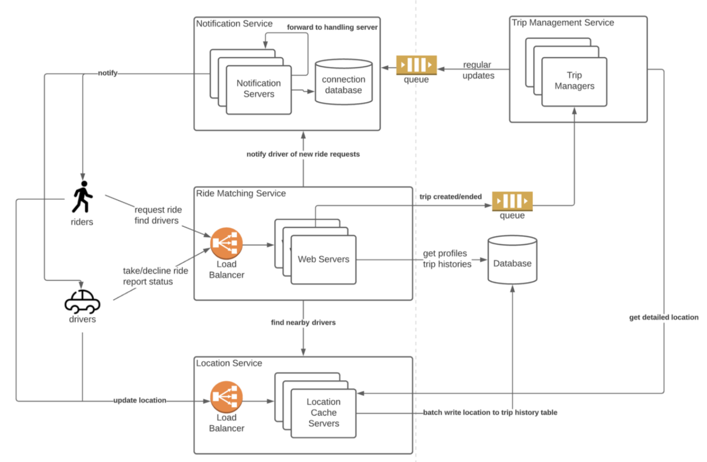
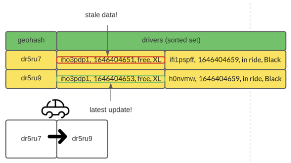
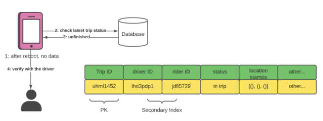

# Uber/Lyft System Design

## Introduction & Requirements of the System

When it comes to getting about in cities, many people choose ride-sharing apps like Uber or Lyft. Indeed, such apps make short-range commute very easy by offering competitive pricing, reasonably short wait time, and high availability. From a technical point of view, systems like these are very interesting because nearest-neighbor searching is hard. In this article, I want to share my design of large-scale ride-sharing apps like Uber/Lyft.

### Functional Requirements

Modern ride-sharing apps offer complex features such as carpooling, trip sharing, real-time chat in addition to ride-matching. In this article, I want to keep the discussion brief and focus only on the core functionality — booking a ride. Below are the functional requirements of our system:

-   Users can request a ride and should be matched to a driver in close proximity
-   Users can see all nearby drivers (although not choosing which one)
-   Drivers can answer/decline requests from nearby riders.
-   When a trip is created, both parties see each other's real-time location.

Needless to say, the system should be scalable and highly available.

### Traffic Estimation

Before talking about traffics, let's examine a unique feature of Uber — its data usage is local. Unlike apps such as Slack or Instagram, inter-region data communication is rarely needed. If you are physically in New York, you can't book a ride in London. Hence, locational data and trips are not replicated across different regions (less-frequently accessed data such as profiles are replicated globally, of course). In this sense, discussing global traffic is not as meaningful as <mark>Regional traffic</mark>.

The amount of ride requests hitting our system varies depending on the app's popularity. Here we assume significant regional traffic for a generalized solution:

-   Group cities by proximity into regions. We need maybe a dozen regions to cover the whole of U.S
-   We expect ~100K active drivers in one region.
-   We expect ~1M active users in one region.
-   The total amount of users globally is 10M.

Assume both drivers and riders emit their location ~5s with each message consisting of longitude, latitude, and additional metadata. In addition, riders regularly check nearby drivers (~5s) and sometimes make a ride request. The amount of QPS and bandwidth we can expect are:

-   We expect ~200K location updates/writes per second
-   We expect ~200K queries per second, double it for peak traffic handling.
-   Each location message consists of ID (8 bytes), longitude and latitude (16 bytes), and other info (64 bytes). The total upload bandwidth is just shy of 88MB/s

## High-level Design

### Database Design

The access pattern of our application determines what schema is used. Let's investigate the requests that hit the database:

#### Read Operations

-   Given a user ID, retrieve its profile
-   Given a user ID, retrieve all trips completed by the user
-   Given longitude and latitude, query all drivers nearby

#### Write Operations

-   Given a user ID, update its location
-   Given a trip ID, the driver can either take/decline the request

### Database Schema

Given the access patterns, sharded SQL is a good choice since no complex relationship queries are made. Note that NoSQL databases like Cassandra could also be used here if strong consistency is not a hard requirement.

#### Driver Profile Table

| Column                  | Type      |
| ----------------------- | --------- |
| Driver ID (primary key) | String    |
| Driver Name             | String    |
| Profile Picture URL     | String    |
| License Plate Number    | String    |
| Car Make and Model      | String    |
| Rating                  | Double    |
| Longitude               | Double    |
| Latitude                | Double    |
| Last updated timestamp  | Timestamp |

#### Rider Profile Table

| Column Name            | Type      |
| ---------------------- | --------- |
| User ID (primary key)  | String    |
| User Name              | String    |
| Profile Picture URL    | String    |
| Longitude              | Double    |
| Latitude               | Double    |
| Last updated timestamp | Timestamp |

#### Trip Details Table

| Column                | Type   |
| --------------------- | ------ |
| Trip ID (primary key) | String |
| Driver ID             | String |
| Rider ID              | String |
| Location Stamps       | List   |
| Status                | String |

In addition to these database tables, we need another high-performance storage to hold frequently-updated location data. Since live location data is inherently ephemeral, persisting them onto disks does not make sense. 

A good alternative would be using an in-memory cache such as Redis or Memcache.

### Cache Schema

#### Location Truth Cache

-   User ID (primary key)
-   Longitude
-   User Type
-   Expiration Timestamp

This cache is the source of truth when it comes to user location. Phone apps send regular updates to maintain accuracy. If a user gets disconnected, its record expires in 30 seconds.

#### Driver proximity Cache

-   geohash (primary key)
-   drivers (sorted set)

The proximity cache is crucial for nearby driver search. Given a location, we can use GeoHash to compute its location key and retrieve all drivers in the grid. I'll talk more about this in the Details section.

## Architecture

With a clearer understanding of what data to store, now it's time for service-oriented designs!

### Notification Service

Whenever the backend needs to send information to the clients, the notification service is used to deliver the messages.

#### Trip Management Service

When a trip is initiated, this service is needed to monitor the locations of all parties as well as plan routes

#### Ride Matching Service

This service handles ride requests. It finds nearby drivers and matchmakes based on driver responses (either accept or decline)

#### Location Service

All users must regularly update their locations via this service.

## Workflow

1.  Bob sends a ride request to the Ride Matching service and hopes to pair with a driver.
2.  The Rider Matching service contacts the Location service and finds all available drivers in the same region.
3.  The Rider Matching service then conducts ranking/filtering and pushes the ride request to selected drivers via the Notification service.

4.  Drivers can accept/decline the request. When received, the Ride Matching Service will send the trip details to the Trip Management service.
5.  The Trip Management service monitors the trip progress and broadcasts driver&rider locations to all parties involved in the trip.

## High Level Architecture - Deep Dive

In this section we will look into the location based problems that are faced by our application.

### How to efficiently look up nearby drivers?

Nearest neighbor search is a hard problem and the scale of our system makes efficient lookup even more difficult. Instead of computing the distance between the rider and every driver in the database, we can use a technique called GeoHash to convert the user's location to a unique key that corresponds to one cell

Therefore, we can use the following heuristic to quickly lookup drivers:

1.  Given a user location, compute its GeoHash from longitude and latitude.
2.  With the GeoHash key available, it's easy to compute the keys for the 8 nearby cells. (see this post)
3.  Query the Location service with all 9 keys; retrieve drivers in those cells.

The accuracy of GeoHash is determined by the key length. The longer the key is, the smaller each cell would be.

What would be a good key size to use? In practice, the key size is determined iteratively based on the number of drivers and riders. In my opinion, a good starting point would be size 6, as it covers a few city blocks.

There are physical limitations for the maximum number of drivers and riders that can fit in one of these cells. Each cell will be an entry in the Driver Proximity cache in Redis.

You might be wondering if Redis can handle this level of traffic. If there are 1M active riders in the region, the number of requests hitting the cluster is around 200K writes/s (each user updates its location ~5s) and 2M reads/s (each user reads 9 Redis keys ~5s).
With even one single AWS c5.18xlarge node with 32 threads, the system can handle the traffic. In practice, we can distribute the workload to dozens of computers and achieve ~100M level RPS capacity.

What about memory limitations? If we use size 6 geohash, there are potentially 32⁶ ~=10 billion keys in the cache, which is crazy. However, we will never reach this amount of keys if empty keys are removed (figure 5). In practice, the number of cache entries is constrained by the number of cars because each car can only be in one cell! Hence, memory is not the bottleneck.

### Location update

Hopefully I've convinced you of the viability of hosting the Location service on Redis. Now let's examine how users update their locations.

There are two tables in the cache — the location truth table and the driver proximity table. The usage of the location truth table is simple. The user's mobile app sends out its location as well as the user ID to the Location service every 5 seconds. 

Whenever a user's accurate location is needed, the system can query this table by user ID.

The proximity table is more interesting in nature. Drivers move around in their cars, which means they often cross one cell to the other. When the backend receives updates from a driver, it doesn't know what cells they have been in the past. 

Hence, it is hard to remove drivers from their old cells. The implication is obvious; the same driver can appear in multiple cells because of the stale data.

To deal with this problem, we could introduce a timestamp to each record. With timestamps, it is easy to filter out stale location data. In practice, the sorted set data structure in Redis is an efficient way to achieve such a feature.

In addition to the driver's location, we can keep information such as vehicle type, trip status (free, in ride) in the cache. With the additional information, ride-matching can be made quickly since the round trip to the database (query vehicle information and trip status) is skipped.

### Trip recoding

Another important feature of our system is trip recording. For a completed trip, we want to store the route that was taken by the driver and make it available to the client for review.

There are many ways to achieve this feature; the simplest way would be relying on the drivers to report their location as well as their trip status. The Location service will batch write all location updates with in-trip status to the database for persistent storage.

Relying on the client app is risky. What if the client app loses all local data while on a trip? It will not know the driver's status before the reboot. To recover from failure, the client app should check if there's any unfinished trip in the database and confirm their status with the driver.

## References

-   <https://towardsdatascience.com/ace-the-system-design-interview-uber-lyft-7e4c212734b3>
