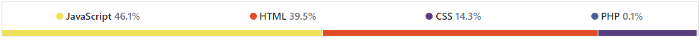

# GitHub Linguist

## Introduction

The files and directories within a repository determine the languages that make up the repository. With GitHub, you can view a repository’s languages to get a quick overview of the repository. But how does this happen? What powers this repository language overview?

You might have noticed this section at the top of your GitHub repositories that gives you an overview of languages contained in the repository.

Well, GitHub uses the open source Linguist library to determine file languages for syntax highlighting and repository statistics. Language statistics will update after you push changes to your default branch (which is usually master).

## Write-Downs

### What is GitHub Linguist?

GitHub Linguist is a library is used on GitHub.com to detect blob languages, ignore binary or vendored files, suppress generated files in diffs, and generate language breakdown graphs. Source: GitHub Linguist Docs.
Basically, Linguist is a library that runs on every GitHub repository. It checks every file and directory and detects the programming language used in that file.

### Conclusion

Linguist defines the list of all languages known to GitHub in a yaml file. In order for a file to be highlighted, a language and lexer must be defined there.

Most languages are detected by their file extension. This is the fastest and most common situation.

### How does Linguist work?

Linguist takes the list of languages it knows from languages.yml and uses a number of methods to try and determine the language used by each file, and the overall repository breakdown.

Linguist starts by going through all the files in a repository and excludes all files that it determines to be binary data, vendored code, generated code, documentation, or are defined as data (e.g. SQL) or prose (e.g. Markdown) languages, whilst taking into account any overrides.

The result of this analysis is used to produce the language stats bar which displays the languages percentages for the files in the repository. The percentages are calculated based on the bytes of code for each language as reported by the List Languages API.

## Installation & Demo & References

[Github - Demo and Installation](https://github.com/github/linguist)

[Github Linguist - APIs](https://docs.github.com/en/rest/repos#list-languages)

[Medium - Getting Started / Introduction to Github Linguist](https://medium.com/@bolajiayodeji/introducing-github-linguist-8f09273ddea1)
